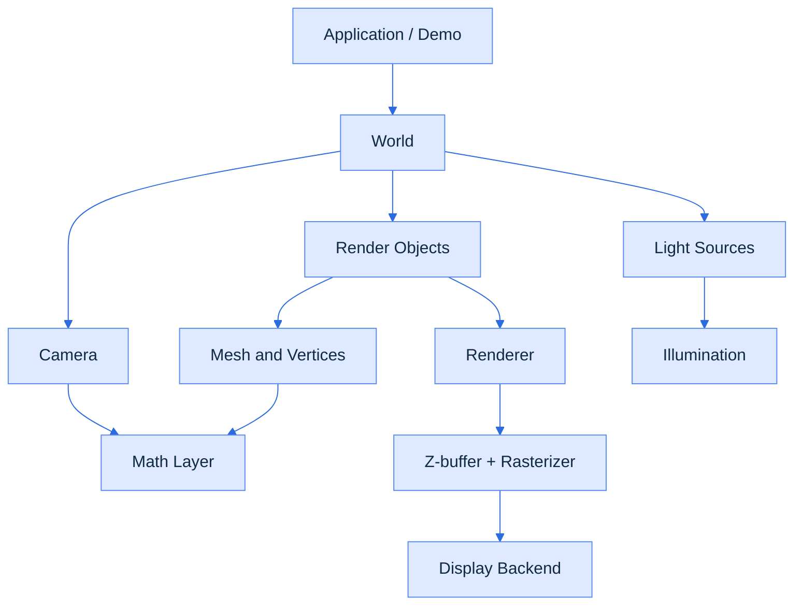
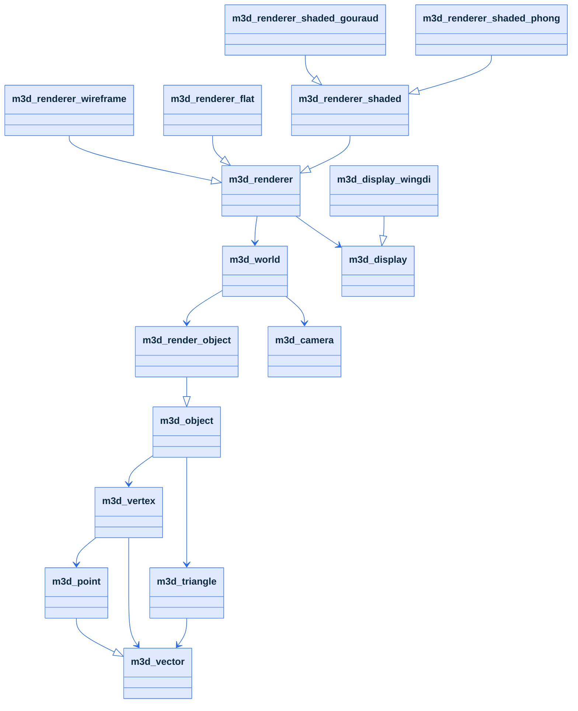
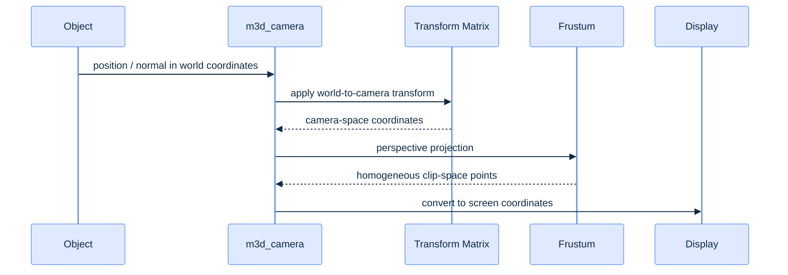

# Architecture

Matrix3D is organized as a layered rendering system. At the lowest level there is a math kernel, then a scene/object model, then a camera/world layer, then renderer implementations, and finally a platform display backend.

The architecture is intentionally direct: data structures are plain C++ classes and arrays, the rendering logic is explicit, and the “scene graph” is reduced to a list of render objects plus one camera and a collection of lights.

## High-level system layout

## Object hierarchy

The object layout is simple and linear:

### Core object model

- m3d_object
  - stores a mesh of vertices and a triangle index list
  - tracks center, direction, orientation, and update state
  - can rotate by pitch, yaw, and roll with pitch(), yaw(), and roll()
- m3d_render_object
  - extends the base object with render metadata
  - stores color, visibility bitsets, and projected depth values
  - contains the per-face visibility state used by the rasterizers
- m3d_triangle
  - describes a triangular face as three indices into the vertex array
  - stores face normal data in object and projected space

## Transformation and math layer

The math subsystem provides the primitive operations used by the renderer:

- m3d_vector
  - carries four components in homogeneous form, usually `{x, y, z, t}`
  - exposes operations for dot and cross products, normalization, scaling, mirroring, and rotation
- m3d_point
  - is a position-like vector with translation semantics
- m3d_matrix
  - holds a 4x4 transformation matrix and supports multiply, transpose, rotation, translation, and orientation transforms
- m3d_matrix_camera
  - builds the camera-to-world viewing transform
- m3d_frustum
  - builds the perspective projection matrix used to convert camera space to normalized projected space

This is a low-level linear algebra API, not a general-purpose simulation framework. The matrix model is explicitly designed around 4D vectors, which matches the homogeneous coordinate conventions used in the renderer.

## Camera and projection model

The camera is defined by a position, a look-at target, screen size, and a frustum.

The code path is:

1. object vertices are transformed into world space via object-local transform
2. camera applies world-to-camera transform
3. frustum converts camera space to clip space
4. screen conversion maps normalized coordinates to pixel coordinates

The important detail is the engine keeps the original depth in the `T` component and normalizes x/y/z by `T`, which is the usual perspective divide used in software rendering.

## World and scene graph

m3d_world is the scene container. It stores:

- a list of render objects
- a list of point lights and ambient light
- a camera used for the current rendering pass

The world also provides sorting logic in sort(). It computes each object's projected center depth and orders the visible list from farthest to nearest in the fragment stage. This is essential for painter's algorithm behavior and z-buffer correctness.

## Lighting model

The light system is intentionally simple but representative:

- m3d_light_source is an abstract base
- m3d_ambient_light adds constant global illumination
- m3d_point_light_source attenuates by distance
- m3d_spot_light_source is a directional variant in the same family

All lighting contributions are computed in m3d_illumination and its singleton m3d_illum.

The typical shading pipeline is:

- ambient light: adds a base intensity
- diffuse light: uses Lambertian term from light direction and face normal
- specular light: uses a half-vector approximation

## Rasterization pipeline

The base renderer manages the common responsibilities:

- clear the screen buffer
- compute visible objects by projecting the mesh
- sort visible objects by depth
- reset and manage z-buffer
- expose scanline interpolation helpers

The concrete renderers are selected by the demo application:

- m3d_renderer_wireframe
  - draws triangle edges only
- m3d_renderer_flat
  - fills triangles with a single object color averaged from vertices
- m3d_renderer_shaded
  - performs intensity interpolation over a triangle surface
- m3d_renderer_shaded_gouraud
  - interpolates vertex colors across the triangle
- m3d_renderer_shaded_phong
  - interpolates normals and world positions to compute per-pixel lighting

## Z-buffer and fill strategy

The rasterizer is scanline-based rather than modern tile-based. It follows a classic software-rendering pattern:

1. sort triangle vertices by screen y
2. build left/right edge scanline buffers
3. interpolate x, z, and shading data across each scanline
4. for each pixel, call the z-buffer test
5. update the pixel only when the depth is closer

This appears in the shared scaffolding and in each concrete renderer. The z-buffer is implemented by m3d_zbuffer, which stores a float depth for every screen pixel and tests whether a new pixel is closer than the current one.

## Display backend

The display abstraction is intentionally thin:

- m3d_display defines the platform-independent interface
- m3d_display_wingdi uses a DIB-backed Win32 surface for the windowed demo

A second backend exists in m3d_display_sdl.cpp, but the default project configuration in CMakeLists.txt compiles the Windows backend instead.

## Detailed pipeline

## Design strengths and trade-offs

### Strengths

- Clear separation between math, scene, and renderer
- Small and understandable core; easy to trace in one session
- Explicit pipeline makes it suitable as a teaching renderer
- Multiple shading modes show the progression from wireframe to Phong

### Trade-offs

- There is no full scene graph, no asset system, and no modern ECS or component architecture
- The object model is tightly coupled to triangle meshes and fixed-size buffers
- The Win32 backend makes the demo Windows-centric despite the code being mostly portable in concept
- The code contains some legacy patterns and older-style C++ conventions

## Architectural summary

The architecture is a classic software rasterizer, implemented as a compact engine library plus a Windows demo. It uses homogeneous math and matrix-based transforms, a custom camera frustum, a z-buffer, and direct scanline interpolation for fill operations. In terms of design, it is intentionally less abstract than a modern engine but much easier to follow and modify.
