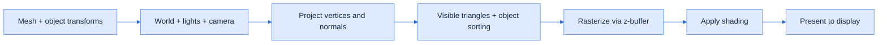

# Matrix3D

<span style="color: green; font-weight: bold;">Matrix3D</span> is a compact C++ 3D rendering sandbox built around a custom math layer, object model, transformation pipeline, lighting, and rasterization pipeline. The repository is intentionally small, opinionated, and educational: it demonstrates how a software renderer can be assembled from low-level primitives without depending on a heavy engine or a standard graphics API.

<span style="color: gray;">This project was originally used as a personal learning and experimentation space for 3D graphics concepts such as matrices, camera projection, visibility, z-buffering, and shading. Today it is best understood as a reusable rendering library with a demo executable in main.cpp.</span>

## What is in this repository

- A custom math subsystem for vectors, points, matrices, and projection transforms
- A mesh and object model for triangle-based 3D assets
- A camera model with view transform and frustum/projection pipeline
- Lighting and illumination functions for ambient, diffuse, and specular shading
- Multiple renderer backends: wireframe, flat, shaded, Gouraud, and Phong
- A world container for objects and light sources
- A display abstraction with a Win32 backend, plus optional SDL work that is currently disabled in the default build
- A demo application in <span style="color: purple; font-weight: bold;">main.cpp</span> that creates a scene with cubes and a sphere

## Repository structure

```text
Matrix3D/
├── CMakeLists.txt              # Build definition for the demo executable
├── README.md                   # Overview of the repository
├── ARCHITECTURE.md             # Design and pipeline of the renderer
├── DEVELOPER_GUIDE.md          # How to build and use this as a library + demo app
├── API_REFERENCE.md            # Class and method reference
├── main.cpp                    # Demo application scene and Win32 window loop
├── m3d_*.hh / m3d_*.cpp        # Core engine modules
├── cubeobject.mes              # Mesh source for a cube
├── sphereobject.mes            # Mesh source for a sphere
├── LICENSE                     # Project license
├── doxygen/                   # Generated documentation output
├── build/                     # Generated CMake build artifacts
└── SDL2*.dll / libfreetype... # Runtime libraries used by optional SDL features
```

## Rendering model in one sentence

The engine transforms object vertices into camera space, projects them into normalized device space, discards back-facing triangles, sorts objects by depth, rasterizes triangles with a z-buffer, and shades pixels according to the configured renderer.

## Main building blocks

- <span style="color: green; font-weight: bold;">m3d_object</span> and <span style="color: green; font-weight: bold;">m3d_render_object</span>
  - define mesh data, vertex normals, triangle normals, and transform state
- <span style="color: green; font-weight: bold;">m3d_world</span>
  - owns objects, light sources, ambient light, and camera
- <span style="color: green; font-weight: bold;">m3d_camera</span>
  - computes the view transform and perspective projection
- <span style="color: green; font-weight: bold;">m3d_renderer</span>
  - orchestrates visibility, sorting, z-buffering, and raster fill logic
- <span style="color: green; font-weight: bold;">m3d_display_wingdi</span>
  - writes final pixels to a window with a Win32 back buffer

## Demo scene

The application in <span style="color: purple; font-weight: bold;">main.cpp</span> creates multiple cubes and a sphere, adds lights, sets a camera, and lets the user switch rendering modes with keyboard input. The code demonstrates the following modes:

- wireframe
- flat shading
- shaded surface rendering
- Gouraud shading
- Phong shading

## Typical execution flow



## Documentation map

- [ARCHITECTURE.md](./ARCHITECTURE.md) — architecture and pipeline design
- [DEVELOPER_GUIDE.md](./DEVELOPER_GUIDE.md) — usage guidance for the library and demo
- [API_REFERENCE.md](./API_REFERENCE.md) — class and method catalog

## Build status and notes

The project is configured with CMake and targets a Windows Win32 executable by default. The CMake setup makes the demo compile as `matrix3d`, while the engine headers are designed to be usable as a library in a broader application. This is not a production engine; it is a compact, readable software renderer intended for learning and experimentation.

